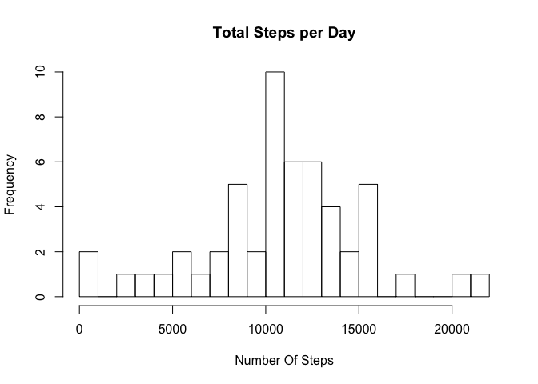
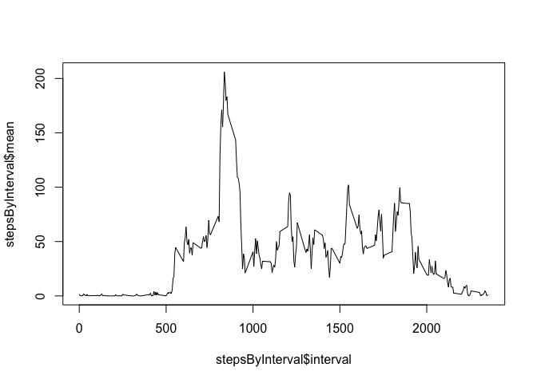
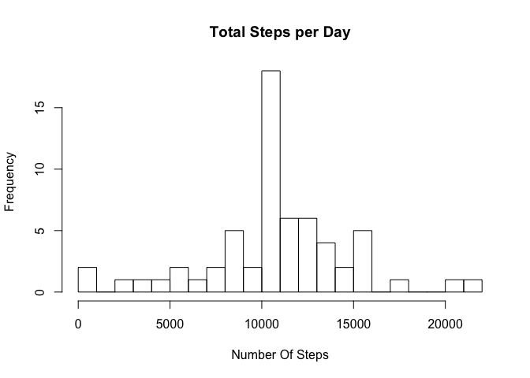
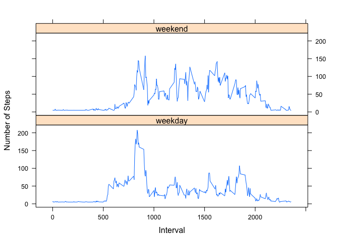

## Loading and preprocessing the data

```r
tempdata <- unz("activity.zip", "activity.csv")
data <- read.csv(tempdata)
```

## What is mean total number of steps taken per day?

```r
stepsByDay <- aggregate(steps ~ date, data, sum)
colnames(stepsByDay) <- c("date", "sum")
hist(stepsByDay$sum, breaks = 20, xlab = "Number Of Steps", main = "Total Steps per Day")
```

<!-- -->

```r
meanStepsDay <- mean(stepsByDay$sum, na.rm = TRUE)
medianStepsDay <- median(stepsByDay$sum, na.rm = TRUE)
```

The average number of steps taken per day is 1.0766189\times 10^{4}.
The median number of steps taken per day is 10765


## What is the average daily activity pattern?

```r
stepsByInterval <- aggregate(steps ~ interval, data, mean)
colnames(stepsByInterval) <- c("interval", "mean")

plot(stepsByInterval$interval,stepsByInterval$mean,type="l")
```

<!-- -->

```r
avg <- stepsByInterval$interval[which.max(stepsByInterval$mean)]
```
835 contains the maximum number of steps on average across all the days. 

## Imputing missing values


```r
missingValues <- sum(!complete.cases(data))
```

Total number of rows with NAs is 2304.


```r
library(dplyr)

meanSteps <- mean(data$steps, na.rm = TRUE)

imputedData <- data
imputedData <- mutate(imputedData, imputedsteps = ifelse(is.na(steps), meanSteps, steps))

stepsByDayNew <- aggregate(imputedsteps ~ date, imputedData, sum)
colnames(stepsByDayNew) <- c("date", "sum")

meanStepsDayNew <- mean(stepsByDayNew$sum, na.rm = TRUE)
medianStepsDayNew <- median(stepsByDayNew$sum, na.rm = TRUE)

hist(stepsByDayNew$sum, breaks = 20, xlab = "Number Of Steps", main = "Total Steps per Day")
```

<!-- -->
The average number of steps taken per day is 1.0766189\times 10^{4}.
The median number of steps taken per day is 1.0766189\times 10^{4}

## Are there differences in activity patterns between weekdays and weekends?

```r
imputedData$wd <-  as.character(weekdays(as.Date(imputedData$date)))
imputedData$we <- imputedData$wd %in% c("Saturday", "Sunday")
imputedData$weekend = factor(imputedData$we, levels = c("FALSE", "TRUE"), labels = c("weekday", "weekend"))
imputedData <-  imputedData[,-c(5:6)]

aggMeans<-aggregate(imputedData$imputedsteps,by=list(imputedData$interval,imputedData$weekend),mean)

colnames(aggMeans)<-c("interval","dayType","steps")

library(lattice)

xyplot(aggMeans$steps ~ aggMeans$interval|aggMeans$dayType,aggMeans,
       type="l",layout=c(1,2),
       xlab="Interval", ylab="Number of Steps")
```

<!-- -->
